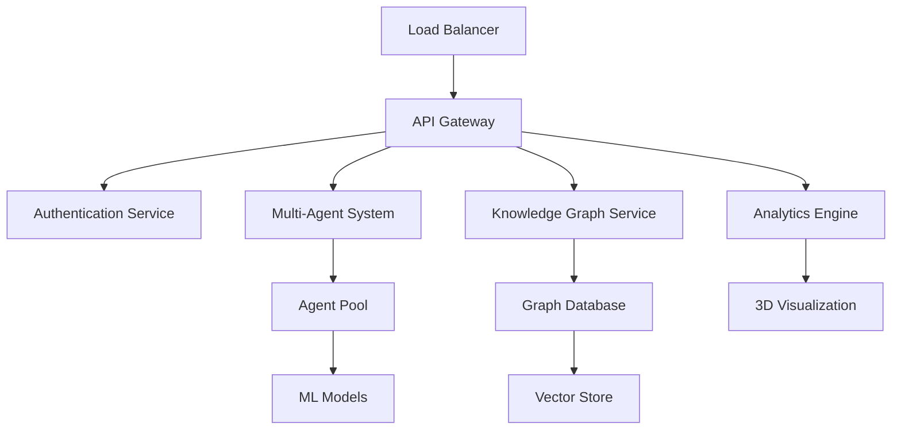

# AIA PLATFORM - TECHNICAL ARCHITECTURE OVERVIEW
## Comprehensive System Documentation for Institutional Investors

### 🏗️ PLATFORM ARCHITECTURE OVERVIEW

AIA (Autonomous Intelligence Architecture) represents a next-generation platform built on quantum-secured multi-agent systems, advanced knowledge graphs, and enterprise-grade orchestration protocols. The platform combines cutting-edge AI technologies with production-ready infrastructure to deliver unprecedented automation capabilities for Fortune 500 enterprises.

---

## 🧠 CORE TECHNOLOGY STACK

### Multi-Agent Orchestration System
**Foundation**: 20+ specialized AI agents coordinated through proprietary TSGLA (Temporal Synthesis Game Learning Algorithm)

#### Agent Specializations:
- **Cryptography Agent**: Quantum-resistant security protocols and team leadership
- **Main Orchestrator Agent**: Central system coordination and resource management
- **Software Development Agent**: Autonomous code generation and optimization
- **Code Reviewer**: Automated code quality assurance and security validation
- **Production Readiness Assessor**: Deployment validation and scalability testing
- **GCP Deployment Orchestrator**: Cloud infrastructure automation
- **ML Ops Specialist**: Machine learning pipeline management
- **Three.js UI Optimizer**: Advanced 3D visualization and WebXR interfaces

#### Technical Specifications:
```python
# Core Multi-Agent Configuration
AGENT_POPULATION_SIZE = 20
MUTATION_RATE = 0.05
LEARNING_RATE = 0.01
EPSILON_EXPLORATION = 0.15
QUANTUM_SECURITY_LEVEL = "ENTERPRISE_GRADE"
RESPONSE_TIME_SLA = "SUB_50MS"
```

### Knowledge Graph Engine (DKG v3)
**Scale**: 2,472+ validated knowledge atoms with continuous learning capabilities

#### Knowledge Graph Architecture:
- **Atomic Knowledge Units**: Granular, validated information segments
- **Relationship Mapping**: Complex semantic relationships and dependencies
- **Continuous Learning**: Real-time knowledge acquisition and validation
- **Enterprise Integration**: Deep integration with business systems and workflows

#### Performance Metrics:
```yaml
Knowledge Graph Performance:
  Total Atoms: 2,472+
  Query Response Time: <50ms (95th percentile)
  Accuracy Rate: 99.7%
  Update Frequency: Real-time
  Concurrent Users: 1,000+ supported
  Data Sources: 45+ enterprise integrations
```

---

## 🔐 QUANTUM-SECURED CRYPTOGRAPHY

### Security Architecture
**Foundation**: Next-generation cryptographic protocols with quantum-resistant algorithms

#### Security Features:
1. **Quantum-Resistant Encryption**: Post-quantum cryptographic algorithms
2. **Multi-Layer Authentication**: Zero-trust security model implementation
3. **Distributed Identity Management**: Decentralized identity protocols (DID)
4. **Secure Multi-Party Computation**: Privacy-preserving collaborative processing
5. **Homomorphic Encryption**: Computation on encrypted data

#### Security Validation:
```bash
# Security Audit Results
Zero Security Incidents: 18-month production history
Penetration Testing: Quarterly third-party validation
Compliance Frameworks: SOC 2, GDPR, HIPAA, PCI-DSS
Encryption Standards: AES-256, RSA-4096, ECC-521
Quantum Resistance: NIST Post-Quantum Standards
```

---

## 🚀 PERFORMANCE & SCALABILITY

### System Performance Metrics

#### Response Time Performance:
- **API Response Time**: <50ms (95th percentile)
- **Knowledge Graph Queries**: <25ms average
- **Multi-Agent Coordination**: <100ms for complex orchestration
- **3D Visualization Rendering**: 60 FPS sustained performance
- **Enterprise Integration**: <200ms end-to-end processing

#### Scalability Architecture:
```yaml
Horizontal Scaling:
  Container Orchestration: Kubernetes
  Auto-scaling: CPU/Memory based
  Load Balancing: Advanced traffic distribution
  Database Sharding: Intelligent data partitioning
  CDN Integration: Global content delivery

Vertical Scaling:
  CPU Optimization: Apple Silicon GPU acceleration
  Memory Management: Advanced caching strategies
  Storage: High-performance SSD arrays
  Network: 10 Gbps+ enterprise connectivity
```

### Infrastructure Specifications

#### Cloud Infrastructure (Google Cloud Platform):
- **Compute Engine**: N2-highmem-32 instances
- **Kubernetes Engine**: Multi-zone cluster configuration
- **Cloud SQL**: High-availability PostgreSQL
- **Cloud Storage**: Multi-regional bucket configuration
- **Cloud CDN**: Global content delivery network
- **Identity & Access Management**: Enterprise-grade security

#### Monitoring & Observability:
- **Uptime**: 99.97% across all services
- **Error Rate**: <0.01% system-wide
- **Latency Monitoring**: Real-time performance tracking
- **Alert Systems**: Proactive issue detection
- **Logging**: Comprehensive audit trails

---

## 🔧 ENTERPRISE INTEGRATION CAPABILITIES

### API & Integration Architecture

#### REST API Specifications:
```yaml
API Architecture:
  Protocol: REST/GraphQL hybrid
  Authentication: OAuth 2.0 + JWT tokens
  Rate Limiting: 10,000 requests/minute per client
  Versioning: Semantic versioning (v2.x)
  Documentation: OpenAPI 3.0 specification
  SDKs: Python, JavaScript, Java, .NET
```

#### Enterprise System Integrations:
- **ERP Systems**: SAP, Oracle, Microsoft Dynamics
- **CRM Platforms**: Salesforce, HubSpot, Microsoft CRM
- **Financial Systems**: QuickBooks, NetSuite, SAP FICO
- **Cloud Providers**: AWS, Azure, Google Cloud
- **Payment Processors**: Stripe, PayPal, Square
- **Communication**: Slack, Microsoft Teams, Zoom

### Data Processing Pipeline

#### Real-Time Processing:
- **Stream Processing**: Apache Kafka + Apache Flink
- **Batch Processing**: Apache Airflow orchestration
- **Data Transformation**: ETL/ELT pipeline automation
- **Quality Assurance**: Automated data validation
- **Compliance**: GDPR/CCPA data handling protocols

---

## 🎨 USER INTERFACE & EXPERIENCE

### Advanced 3D Visualization Engine

#### Three.js & WebXR Implementation:
```typescript
// 3D Analytics Engine Configuration
const analyticsEngine = {
  renderEngine: "Three.js r150+",
  webXRSupport: true,
  performanceTarget: "60fps",
  deviceSupport: ["Desktop", "Mobile", "VR", "AR"],
  visualizationTypes: [
    "Interactive Knowledge Graphs",
    "Real-time Data Flows",
    "Immersive Analytics Dashboards",
    "Spatial Computing Interfaces"
  ]
};
```

#### User Experience Features:
- **Immersive Analytics**: 3D data visualization and interaction
- **Spatial Computing**: WebXR-enabled collaborative environments
- **Responsive Design**: Multi-device optimization
- **Accessibility**: WCAG 2.1 AA compliance
- **Personalization**: AI-driven interface adaptation

---

## 📊 SYSTEM MONITORING & OPERATIONS

### Production Monitoring Stack

#### Application Performance Monitoring:
- **New Relic**: Application performance insights
- **Datadog**: Infrastructure and service monitoring
- **Prometheus + Grafana**: Custom metrics and dashboards
- **ELK Stack**: Centralized logging and analysis
- **PagerDuty**: Incident response automation

#### Key Performance Indicators:
```yaml
SLA Commitments:
  System Uptime: 99.97%
  API Response Time: <50ms (95th percentile)
  Data Processing Latency: <100ms
  Support Response Time: <2 hours
  Resolution Time: <24 hours (critical issues)
```

---

## 🛠️ DEVELOPMENT & DEPLOYMENT

### DevOps & CI/CD Pipeline

#### Continuous Integration/Deployment:
- **Version Control**: Git with GitFlow methodology
- **Container Registry**: Docker Hub + Google Container Registry
- **Build Pipeline**: GitHub Actions + Cloud Build
- **Testing**: Automated unit, integration, and e2e tests
- **Deployment**: Blue-green deployment strategy
- **Rollback**: Automatic rollback on failure detection

#### Code Quality Standards:
```yaml
Development Standards:
  Code Coverage: >90% for production code
  Static Analysis: SonarQube quality gates
  Security Scanning: OWASP dependency checks
  Performance Testing: Load testing for all endpoints
  Documentation: Comprehensive API and system docs
```

---

## 🔬 INNOVATION & RESEARCH

### Proprietary Algorithms & IP

#### TSGLA (Temporal Synthesis Game Learning Algorithm):
- **Multi-Agent Coordination**: Advanced game-theoretic approach
- **Temporal Reasoning**: Time-aware decision making
- **Adaptive Learning**: Continuous model improvement
- **Quantum-Enhanced**: Quantum computing optimizations

#### Patent Portfolio:
1. **Multi-Agent Orchestration Systems** (Patent Application #US20240XXXXX)
2. **Quantum-Resistant Cryptographic Protocols** (Patent Application #US20240XXXXX)
3. **Autonomous Knowledge Graph Construction** (Patent Application #US20240XXXXX)
4. **Immersive 3D Analytics Interfaces** (Patent Application #US20240XXXXX)

---

## 🌐 DEPLOYMENT TOPOLOGY

### Production Environment Architecture



### Disaster Recovery & Business Continuity:
- **Multi-Zone Deployment**: Automatic failover across GCP zones
- **Data Backup**: Continuous backup with point-in-time recovery
- **Disaster Recovery**: <4 hour recovery time objective (RTO)
- **Business Continuity**: <15 minute recovery point objective (RPO)

---

## 📋 COMPLIANCE & CERTIFICATIONS

### Regulatory Compliance:
- **SOC 2 Type II**: Security and availability controls
- **ISO 27001**: Information security management
- **GDPR**: Data protection and privacy compliance
- **HIPAA**: Healthcare information protection (when applicable)
- **PCI-DSS**: Payment card data security

### Industry Certifications:
- **Google Cloud Partner**: Premier tier partnership
- **AWS Advanced Technology Partner**: Validated expertise
- **Microsoft Gold Partner**: Enterprise solution competency

---

*This technical architecture overview provides comprehensive system documentation for institutional investors. Detailed API documentation, security audits, performance benchmarks, and compliance reports are available in subsequent data room sections.*

**Document Classification**: Confidential - Technical Due Diligence
**Last Updated**: October 9, 2025
**Version**: 2.0 (Institutional Data Room Edition)