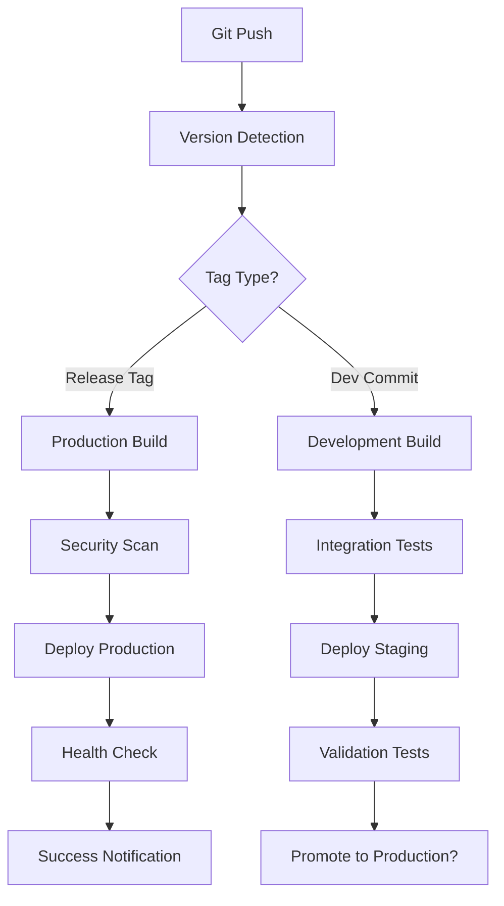

# Efficient AIA System Deployment Strategy

## Executive Summary

This strategy eliminates reliance on misleading image tags like "latest" and ensures only the repository's latest AIA system is deployed to GCP with automated cleanup.

## Current Issues Identified

1. **Problematic `latest` tags** in `cloudbuild-optimized.yaml` lines 26, 135
2. **Multiple deployment configurations** causing potential conflicts
3. **No semantic versioning** strategy
4. **No automated cleanup** of orphaned deployments
5. **Inconsistent image references** across deployment files

## 🎯 Core Strategy: Immutable Deployment Pipeline

### 1. Semantic Versioning with Git Tags

Replace the current SHA + `latest` tagging with semantic versioning:

```bash
# Current problematic approach
gcr.io/${PROJECT_ID}/aia-system-optimized:${SHORT_SHA}
gcr.io/${PROJECT_ID}/aia-system-optimized:latest

# New semantic versioning approach
gcr.io/${PROJECT_ID}/aia-system:v1.2.3-abc1234
gcr.io/${PROJECT_ID}/aia-system:v1.2.3
```

### 2. Version Management Strategy

#### Git Tag-Based Versioning
```bash
# Production releases
git tag v1.2.3
git push origin v1.2.3

# Pre-release versions
git tag v1.2.3-rc.1
git push origin v1.2.3-rc.1

# Development builds
# Automatically tagged as: v1.2.3-dev.abc1234
```

#### Image Tag Structure
```
Format: v{MAJOR}.{MINOR}.{PATCH}[-{PRERELEASE}][+{BUILD}]

Examples:
- v1.2.3                    # Stable release
- v1.2.3-rc.1               # Release candidate
- v1.2.3-dev.abc1234        # Development build
- v1.2.3+build.123          # Build with metadata
```

### 3. Deployment Pipeline Architecture



### 4. Immutable Image Strategy

#### Build Process
1. **Version Calculation**: Determine version from git tags and commits
2. **Multi-Service Build**: Build all services with same version tag
3. **Immutable Tagging**: Never overwrite existing tags
4. **Registry Validation**: Verify images don't exist before push

#### Container Services
```yaml
# All services use the same version tag
services:
  - name: aia-api
    image: gcr.io/${PROJECT_ID}/aia-api:${VERSION}
  - name: aia-frontend  
    image: gcr.io/${PROJECT_ID}/aia-frontend:${VERSION}
  - name: aia-orchestrator
    image: gcr.io/${PROJECT_ID}/aia-orchestrator:${VERSION}
```

## 🚀 Implementation Plan

### Phase 1: Version Management Setup

1. **Create Version Management Script**
   ```bash
   # scripts/version-manager.sh
   #!/bin/bash
   
   get_version() {
       if git describe --tags --exact-match HEAD 2>/dev/null; then
           # On a tag - use tag as version
           echo $(git describe --tags --exact-match HEAD)
       else
           # Not on a tag - create development version
           LAST_TAG=$(git describe --tags --abbrev=0 2>/dev/null || echo "v0.0.0")
           COMMIT_SHORT=$(git rev-parse --short HEAD)
           echo "${LAST_TAG}-dev.${COMMIT_SHORT}"
       fi
   }
   ```

2. **Update Cloud Build Configuration**
   - Remove `latest` tag references
   - Add version management step
   - Implement tag validation

### Phase 2: Cleanup Automation

1. **Orphaned Image Cleanup**
   ```bash
   # Cleanup images older than 30 days, keep last 10 versions
   gcloud container images list-tags gcr.io/${PROJECT_ID}/aia-system \
       --limit=999999 \
       --sort-by=timestamp \
       --format="get(digest,timestamp)" \
   | while read digest timestamp; do
       # Keep images from last 10 deployments
       # Delete images older than 30 days
   done
   ```

2. **Kubernetes Resource Cleanup**
   ```bash
   # Remove orphaned deployments not matching current version
   kubectl get deployments -o json | jq '.items[] | select(.metadata.labels.version != "'$CURRENT_VERSION'") | .metadata.name'
   ```

### Phase 3: Enhanced Monitoring

1. **Deployment Tracking**
   - Version dashboard showing current vs desired state
   - Deployment history with rollback capabilities
   - Resource utilization per version

2. **Alert System**
   - Failed deployment notifications
   - Version drift detection
   - Resource cleanup notifications

## 📋 Deployment Workflow

### Daily Operations

1. **Development Deployment**
   ```bash
   # Developer pushes code
   git push origin feature/new-feature
   
   # Automatic build with dev tag
   # v1.2.3-dev.abc1234
   # Deploy to staging environment
   ```

2. **Production Release**
   ```bash
   # Create release tag
   git tag v1.2.4
   git push origin v1.2.4
   
   # Automatic production deployment
   # Comprehensive testing
   # Blue-green deployment
   ```

3. **Emergency Rollback**
   ```bash
   # Rollback to previous version
   ./scripts/rollback.sh v1.2.3
   
   # Automatic verification
   # Health checks
   # Notification
   ```

### Pre-Deployment Checks

1. **Image Validation**
   - Verify image doesn't exist (prevent overwrites)
   - Security vulnerability scanning
   - Dependency audit

2. **Environment Validation**
   - Resource availability check
   - Database migration compatibility
   - Service dependency verification

3. **Rollback Preparation**
   - Current state snapshot
   - Database backup
   - Configuration backup

## 🛡️ Safety Mechanisms

### 1. Immutable Infrastructure
- Never modify running deployments
- Always deploy new versions
- Maintain deployment history

### 2. Gradual Rollouts
```yaml
# Kubernetes deployment strategy
strategy:
  type: RollingUpdate
  rollingUpdate:
    maxSurge: 1
    maxUnavailable: 0
```

### 3. Health Checks
```yaml
livenessProbe:
  httpGet:
    path: /health
    port: 8000
  initialDelaySeconds: 60
  periodSeconds: 30

readinessProbe:
  httpGet:
    path: /ready
    port: 8000
  initialDelaySeconds: 10
  periodSeconds: 5
```

### 4. Circuit Breakers
- Automatic rollback on health check failures
- Traffic routing based on service health
- Alert escalation on repeated failures

## 🔧 Comprehensive Cleanup Strategy

### AIA-Only Deployment Policy
**Core Principle**: Only the AIA system from the repository should exist in the GCP environment, and all AIA services must run the exact code from the current repository state.

#### Repository Code Enforcement
1. **Current Code Only**: All deployed AIA services must run the latest repository code
2. **Version Drift Prevention**: Detect and update services running outdated code
3. **Repository State Verification**: Compare deployed versions against repository commits
4. **Force Refresh**: Automatically update AIA services to match repository state

### Image Registry Cleanup
1. **AIA-Only Images**: Remove all non-AIA images from registry
2. **Retention Policy**: Keep last 10 versions per AIA service
3. **Age-Based Cleanup**: Remove AIA images older than 90 days
4. **Foreign Image Detection**: Scan and remove any images not built from the repository

### Complete Namespace Cleanup
1. **Namespace Audit**: Scan all namespaces for non-AIA resources
2. **Orphaned Namespace Removal**: Delete namespaces not defined in repository
3. **Resource Reconciliation**: Ensure only repository-defined resources exist
4. **Cross-Namespace Dependencies**: Verify no external dependencies remain

#### Approved Namespaces (Repository-Defined)
```yaml
allowed_namespaces:
  - aia-production      # Main production namespace
  - aia-staging         # Staging environment
  - aia-monitoring      # Monitoring stack
  - kube-system         # Kubernetes system (protected)
  - kube-public         # Kubernetes public (protected)
  - gke-system          # GKE system (protected)
```

### Kubernetes Resource Cleanup
1. **Complete Resource Audit**: Scan all resources across all namespaces
2. **AIA Resource Identification**: Match resources against repository definitions
3. **Orphaned Resource Removal**: Delete any non-repository resources
4. **ConfigMap/Secret Cleanup**: Remove unused configurations not in repository
5. **PVC Cleanup**: Remove persistent volumes not attached to AIA services

### Database and Storage Cleanup
1. **Database Instance Audit**: Ensure only AIA databases exist
2. **Storage Bucket Cleanup**: Remove non-AIA storage resources
3. **Backup Cleanup**: Keep only AIA system backups
4. **Log Cleanup**: Remove logs from non-AIA systems

### Network and Security Cleanup
1. **Service Account Audit**: Remove non-AIA service accounts
2. **Firewall Rules**: Keep only AIA-required network rules
3. **Load Balancer Cleanup**: Remove unused load balancers
4. **SSL Certificate Management**: Keep only AIA domain certificates

## 📊 Monitoring and Observability

### Version Tracking Dashboard
- Current deployed versions across all services
- Deployment success rate by version
- Resource utilization trends
- Error rates by version

### Alerts and Notifications
- Failed deployment alerts
- Version drift warnings
- Resource cleanup notifications
- Security vulnerability alerts

## 🚀 Getting Started

### Step 1: Implement Version Management
```bash
cd /Users/wXy/dev/Projects/aia
git checkout -b feature/deployment-strategy
# Apply version management changes
```

### Step 2: Update Build Configuration
- Modify Cloud Build files to use semantic versioning
- Remove latest tag references
- Add validation steps

### Step 3: Deploy Monitoring
- Setup version tracking dashboard
- Configure alert rules
- Test rollback procedures

### Step 4: Automated Testing
- Integration tests for version management
- Deployment pipeline testing
- Cleanup automation testing

## 🎯 Success Metrics

1. **Deployment Reliability**: >99.5% successful deployments
2. **Rollback Time**: <5 minutes for emergency rollbacks
3. **Version Consistency**: 100% version alignment across services
4. **Resource Efficiency**: <5% orphaned resources at any time
5. **Security Compliance**: 0 known vulnerabilities in production

---

*This strategy ensures that only the latest, validated version of the AIA system from the repository is deployed to GCP, with complete cleanup of outdated resources and robust rollback capabilities.*
