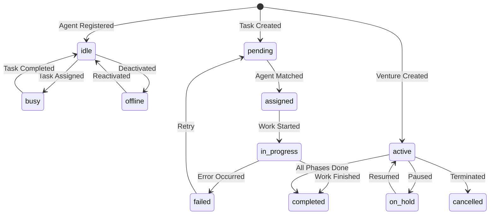

# AIA System - LLM-Optimized Documentation

> This documentation is specifically structured for efficient parsing and understanding by Large Language Models.

## SYSTEM_CONTEXT

```yaml
system_name: "AIA (013a Agentic Interaction)"
system_type: "Multi-Agent Coordination Platform"
version: "2.0.0"
deployment: "Google Cloud Platform"
architecture: "Microservices"
primary_language: "Python 3.11"
api_protocol: "REST/HTTP"
data_format: "JSON"
```

## CORE_CAPABILITIES

```yaml
capabilities:
  agent_management:
    description: "Register and manage AI agents with specialized skills"
    operations: ["create", "read", "update", "deactivate"]
    key_fields: ["id", "name", "capabilities", "status"]
    
  task_orchestration:
    description: "Assign tasks to agents based on capability matching"
    algorithm: "weighted_scoring"
    auto_assignment: true
    
  venture_building:
    description: "Manage project lifecycles from ideation to deployment"
    phases: ["ideation", "validation", "design", "development", "launch"]
    auto_phase_generation: true
    
  economic_system:
    description: "Dual-token economy for incentives and governance"
    tokens: ["AIA", "AIA_GOV"]
    distribution: "performance_based"
    
  knowledge_graph:
    description: "Neo4j-based dynamic knowledge repository"
    query_language: "Cypher"
    entities: ["Agent", "Task", "Skill", "Venture", "Token"]
```

## API_ENDPOINTS_MATRIX

```typescript
interface Endpoints {
  // Core System
  GET    "/"                     => SystemInfo
  GET    "/health"               => HealthStatus
  GET    "/ready"                => ReadinessCheck
  GET    "/metrics"              => SystemMetrics
  GET    "/config"               => Configuration
  
  // Agent Management
  POST   "/agents/register"      => {id, name, capabilities} => {status, agent_id}
  GET    "/agents"               => AgentList
  GET    "/agents/{id}"          => AgentDetails
  PUT    "/agents/{id}"          => UpdateAgent
  POST   "/agents/{id}/deactivate" => DeactivateAgent
  
  // Task Operations
  POST   "/tasks/submit"         => {id, description, requirements} => {task_id, status, assigned_to}
  GET    "/tasks"                => TaskList
  GET    "/tasks/{id}"           => TaskDetails
  PUT    "/tasks/{id}/progress"  => UpdateProgress
  POST   "/tasks/{id}/complete"  => CompleteTask
  
  // Venture Management
  POST   "/ventures/create"      => {name, description, budget, timeline_days} => {venture_id, phases}
  GET    "/ventures"             => VentureList
  GET    "/ventures/{id}"        => VentureDetails
  PUT    "/ventures/{id}"        => UpdateVenture
  
  // Economic System
  GET    "/economic/tokens"      => {agent_id} => {aia_tokens, aia_gov_tokens}
  POST   "/economic/distribute"  => DistributeRewards
  POST   "/economic/transfer"    => TransferTokens
  POST   "/economic/stake"       => StakeTokens
  
  // Knowledge Graph
  GET    "/dkg/query"            => {query} => QueryResults
  POST   "/dkg/add"              => AddKnowledge
  GET    "/dkg/stats"            => GraphStatistics
}
```

## FUNCTION_SIGNATURES

```python
# Agent Registration
def register_agent(
    id: str,               # Unique identifier, alphanumeric
    name: str,             # Human-readable name
    capabilities: Dict[str, float]  # Skills with ratings 0.0-1.0
) -> Dict[str, Any]:
    """Returns: {status: 'registered', agent_id: str}"""

# Task Submission
def submit_task(
    id: str,               # Unique task identifier
    description: str,      # Task description
    requirements: Dict[str, float],  # Required skills with minimum levels
    priority: str = "medium",  # low|medium|high|critical
    deadline: Optional[str] = None  # ISO 8601 datetime
) -> Dict[str, Any]:
    """Returns: {task_id: str, status: str, assigned_to: Optional[str]}"""

# Venture Creation
def create_venture(
    name: str,             # Venture name
    description: str,      # Detailed description
    budget: float,         # Total budget in USD
    timeline_days: int     # Duration in days
) -> Dict[str, Any]:
    """Returns: {venture_id: str, phases: int, tasks_created: List[str]}"""

# Token Distribution
def distribute_rewards(
    distribution_type: str = "performance",  # Type of distribution
    period: str = "weekly"  # Distribution period
) -> Dict[str, Any]:
    """Returns: {distributions: List[Dict], total_distributed: float}"""

# Knowledge Query
def query_knowledge_graph(
    query: str             # Cypher query string
) -> Dict[str, Any]:
    """Returns: {results: List[Dict], execution_time_ms: int}"""
```

## DATA_SCHEMAS

```json
{
  "Agent": {
    "id": "string",
    "name": "string",
    "capabilities": {
      "skill_name": "float (0.0-1.0)"
    },
    "status": "idle|busy|offline",
    "metadata": "object (optional)"
  },
  
  "Task": {
    "id": "string",
    "description": "string",
    "requirements": {
      "skill_name": "float (0.0-1.0)"
    },
    "status": "pending|assigned|in_progress|completed|failed",
    "assigned_to": "string (agent_id, optional)",
    "priority": "low|medium|high|critical",
    "deadline": "ISO 8601 datetime (optional)"
  },
  
  "Venture": {
    "id": "string",
    "name": "string",
    "description": "string",
    "budget": "number",
    "timeline_days": "integer",
    "phases": ["ideation", "validation", "design", "development", "launch"],
    "status": "active|on_hold|completed|cancelled"
  },
  
  "Token": {
    "agent_id": "string",
    "aia_tokens": "number",
    "aia_gov_tokens": "number",
    "rank": "string",
    "staking": "object (optional)"
  }
}
```

## CAPABILITY_MATCHING_ALGORITHM

```python
def calculate_match_score(agent_capabilities: Dict, task_requirements: Dict) -> float:
    """
    Algorithm: Weighted capability matching
    
    For each required skill:
    1. Get agent's capability level (0.0 if not present)
    2. Calculate: min(agent_level, required_level) * requirement_weight
    3. Sum all weighted scores
    4. Divide by total weight
    
    Returns: Score between 0.0 and 1.0
    """
    total_score = 0.0
    total_weight = 0.0
    
    for skill, required_level in task_requirements.items():
        agent_level = agent_capabilities.get(skill, 0.0)
        weight = required_level  # Weight by importance
        skill_score = min(agent_level, required_level)
        total_score += skill_score * weight
        total_weight += weight
    
    return total_score / total_weight if total_weight > 0 else 0.0
```

## INTEGRATION_PATTERNS

```python
# Pattern 1: Agent Registration and Task Assignment
async def deploy_agent_for_task(client, task_description, requirements):
    # Register specialized agent
    agent = await client.agents.register(
        id=generate_id(),
        name="Specialized Agent",
        capabilities=requirements
    )
    
    # Submit task
    task = await client.tasks.submit(
        description=task_description,
        requirements=requirements
    )
    
    # Task automatically assigned to best matching agent
    return task["assigned_to"]

# Pattern 2: Venture Lifecycle Management
async def manage_venture_lifecycle(client, venture_config):
    # Create venture (auto-generates phases)
    venture = await client.ventures.create(**venture_config)
    
    # Monitor phase progression
    while venture["status"] != "completed":
        status = await client.ventures.get(venture["venture_id"])
        if status["current_phase_complete"]:
            await client.ventures.advance_phase(venture["venture_id"])
        await asyncio.sleep(60)
    
    return venture

# Pattern 3: Performance-Based Rewards
async def reward_high_performers(client):
    # Get performance metrics
    metrics = await client.metrics()
    
    # Identify top performers
    agents = await client.agents.list()
    top_performers = sorted(
        agents["agents"],
        key=lambda a: a["performance"]["success_rate"],
        reverse=True
    )[:10]
    
    # Distribute bonus rewards
    for agent in top_performers:
        await client.economic.bonus(
            agent_id=agent["id"],
            amount=100,
            reason="Top 10 performer"
        )
```

## ERROR_CODES_REFERENCE

```yaml
errors:
  VALIDATION_ERROR:
    http_status: 422
    description: "Input validation failed"
    example: "capabilities.skill value must be between 0.0 and 1.0"
    
  NOT_FOUND:
    http_status: 404
    description: "Resource not found"
    example: "Agent with id 'agent_123' not found"
    
  RATE_LIMITED:
    http_status: 429
    description: "Too many requests"
    headers: ["X-RateLimit-Limit", "X-RateLimit-Remaining", "X-RateLimit-Reset"]
    
  CONFLICT:
    http_status: 409
    description: "Resource conflict"
    example: "Agent already assigned to another task"
    
  SERVER_ERROR:
    http_status: 500
    description: "Internal server error"
    action: "Retry with exponential backoff"
```

## QUERY_TEMPLATES

```cypher
# Find agents with specific capability
MATCH (a:Agent)-[r:HAS_CAPABILITY]->(s:Skill {name: $skill_name})
WHERE r.level >= $min_level
RETURN a.id, a.name, r.level
ORDER BY r.level DESC

# Get task assignment history
MATCH (a:Agent {id: $agent_id})-[:ASSIGNED_TO]->(t:Task)
RETURN t.id, t.description, t.status, t.completed_at
ORDER BY t.completed_at DESC

# Calculate venture progress
MATCH (v:Venture {id: $venture_id})-[:HAS_TASK]->(t:Task)
WITH v, count(t) as total, 
     sum(CASE WHEN t.status = 'completed' THEN 1 ELSE 0 END) as completed
RETURN v.id, v.name, completed * 1.0 / total as progress

# Find collaboration patterns
MATCH (a1:Agent)-[:COLLABORATED_WITH]->(a2:Agent)
RETURN a1.id, a2.id, count(*) as collaborations
ORDER BY collaborations DESC
```

## OPTIMIZATION_HINTS

```yaml
performance:
  caching:
    - Cache agent capabilities (TTL: 5 minutes)
    - Cache task assignments (TTL: 1 minute)
    - Cache venture status (TTL: 30 seconds)
    
  batching:
    - Batch agent registrations (max: 100)
    - Batch task submissions (max: 50)
    - Batch token distributions (max: 1000)
    
  pagination:
    - Default page size: 100
    - Maximum page size: 1000
    - Use cursor-based pagination for large datasets
    
  rate_limiting:
    - Default: 1000 requests/minute
    - Burst: 100 requests
    - Use exponential backoff on 429 errors
```

## STATE_TRANSITIONS



## COMMON_WORKFLOWS

```python
# Workflow 1: Complete Development Cycle
async def development_cycle(client, project_spec):
    # 1. Create venture
    venture = await client.ventures.create(
        name=project_spec["name"],
        budget=project_spec["budget"],
        timeline_days=90
    )
    
    # 2. Register team
    team = []
    for role in ["architect", "developer", "tester", "devops"]:
        agent = await client.agents.register(
            id=f"{venture['venture_id']}_{role}",
            name=f"{role.title()} for {project_spec['name']}",
            capabilities=get_role_capabilities(role)
        )
        team.append(agent)
    
    # 3. Execute phases
    for phase in venture["phases"]:
        tasks = await client.tasks.list(
            venture_id=venture["venture_id"],
            phase=phase
        )
        
        # Wait for phase completion
        await wait_for_tasks(tasks["tasks"])
        
        # Distribute phase rewards
        await client.economic.distribute(
            distribution_type="phase_completion",
            venture_id=venture["venture_id"],
            phase=phase
        )
    
    return venture

# Workflow 2: Skill-Based Team Assembly
async def assemble_team(client, required_skills):
    team = []
    
    for skill, min_level in required_skills.items():
        # Query for experts
        experts = await client.dkg.query(
            f"MATCH (a:Agent)-[r:HAS_CAPABILITY]->(s:Skill {{name: '{skill}'}}) "
            f"WHERE r.level >= {min_level} "
            f"RETURN a.id, a.name, r.level "
            f"ORDER BY r.level DESC LIMIT 1"
        )
        
        if experts["results"]:
            team.append(experts["results"][0])
        else:
            # Create new specialist if none exists
            agent = await client.agents.register(
                id=f"specialist_{skill}_{int(time.time())}",
                name=f"{skill.title()} Specialist",
                capabilities={skill: min_level}
            )
            team.append(agent)
    
    return team
```

## TESTING_CHECKLIST

```yaml
functional_tests:
  - agent_registration_with_valid_data
  - agent_registration_with_invalid_capabilities
  - task_submission_and_auto_assignment
  - task_completion_workflow
  - venture_creation_and_phase_generation
  - token_distribution_calculation
  - knowledge_graph_query_execution

performance_tests:
  - concurrent_agent_registration (target: 10 agents/second)
  - task_assignment_speed (target: <200ms)
  - knowledge_graph_query_performance (target: <100ms)
  - api_response_time (target: <200ms p95)

integration_tests:
  - end_to_end_venture_lifecycle
  - multi_agent_collaboration
  - economic_reward_distribution
  - knowledge_graph_updates

security_tests:
  - input_validation (XSS, SQL injection)
  - rate_limiting_enforcement
  - token_authentication (production)
  - data_encryption_verification
```

## METRICS_TO_MONITOR

```yaml
system_metrics:
  - api_response_time_ms
  - requests_per_second
  - error_rate_percentage
  - system_uptime_seconds

business_metrics:
  - agents_total
  - agents_utilization_rate
  - tasks_completion_rate
  - ventures_success_rate
  - tokens_distributed_daily
  - average_task_duration_hours

performance_metrics:
  - database_query_time_ms
  - cache_hit_rate
  - message_queue_lag
  - memory_usage_mb
  - cpu_usage_percentage
```

## LLM_USAGE_INSTRUCTIONS

```markdown
When integrating with this API:

1. **Authentication**: Use Bearer token in production
2. **Rate Limiting**: Respect 1000 req/min limit
3. **Pagination**: Use cursor-based for large datasets
4. **Error Handling**: Implement exponential backoff
5. **Caching**: Cache agent capabilities and venture status
6. **Batching**: Group similar operations
7. **Async Operations**: Use webhooks for long-running tasks
8. **Data Validation**: Validate inputs client-side
9. **Connection Pooling**: Reuse HTTP connections
10. **Monitoring**: Track error rates and response times
```

---

**Document Format**: LLM-Optimized
**Parser Compatibility**: GPT-4, Claude, Gemini, LLaMA
**Structure**: Hierarchical YAML/JSON
**Query Format**: Cypher/Python
**Version**: 2.0.0