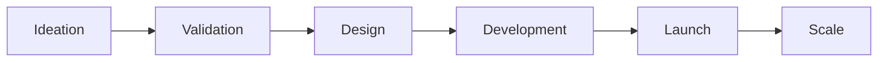

# AIA System - Complete API Documentation

## API Overview

**Base URL**: `https://api.aia.system` (Production)  
**Version**: 2.0.0  
**Protocol**: HTTPS  
**Authentication**: Bearer Token (Production) / None (Development)  
**Content-Type**: `application/json`  
**Rate Limit**: 1000 requests/minute per IP

## Table of Contents

1. [Authentication](#authentication)
2. [Core Endpoints](#core-endpoints)
3. [Agent Management](#agent-management)
4. [Task Operations](#task-operations)
5. [Venture Management](#venture-management)
6. [Economic System](#economic-system)
7. [Knowledge Graph](#knowledge-graph)
8. [Error Handling](#error-handling)
9. [Webhooks](#webhooks)
10. [SDKs & Libraries](#sdks--libraries)

---

## Authentication

### Development Mode
No authentication required for development/testing.

### Production Mode
```http
Authorization: Bearer <your-api-token>
```

### Obtaining API Token
```bash
POST /auth/token
Content-Type: application/json

{
  "client_id": "your-client-id",
  "client_secret": "your-client-secret",
  "grant_type": "client_credentials"
}
```

**Response:**
```json
{
  "access_token": "eyJhbGciOiJIUzI1NiIs...",
  "token_type": "Bearer",
  "expires_in": 3600
}
```

---

## Core Endpoints

### Get System Information

Returns basic information about the AIA system.

```http
GET /
```

**Response:** `200 OK`
```json
{
  "service": "AIA System",
  "version": "2.0.0",
  "status": "operational",
  "service_type": "orchestrator",
  "timestamp": "2024-09-09T14:00:00Z",
  "environment": "production"
}
```

**Example:**
```python
import requests

response = requests.get("https://api.aia.system/")
system_info = response.json()
print(f"System Version: {system_info['version']}")
```

---

### Health Check

Check if the system is healthy and responding.

```http
GET /health
```

**Response:** `200 OK`
```json
{
  "status": "healthy",
  "service": "orchestrator",
  "timestamp": 1234567890.123,
  "checks": {
    "database": "healthy",
    "cache": "healthy",
    "message_queue": "healthy"
  }
}
```

**Use Case:** Monitoring and alerting systems should poll this endpoint.

---

### Readiness Check

Check if the system is ready to accept requests.

```http
GET /ready
```

**Response:** `200 OK` / `503 Service Unavailable`
```json
{
  "status": "ready",
  "checks": {
    "api": true,
    "config": true,
    "registry": true,
    "database": true
  }
}
```

---

### Get System Metrics

Retrieve current system performance metrics.

```http
GET /metrics
```

**Response:** `200 OK`
```json
{
  "agents": {
    "total": 25,
    "idle": 15,
    "busy": 10,
    "offline": 0
  },
  "tasks": {
    "total": 150,
    "pending": 20,
    "assigned": 50,
    "in_progress": 30,
    "completed": 50
  },
  "ventures": {
    "active": 5,
    "completed": 12,
    "total": 17
  },
  "performance": {
    "avg_response_time_ms": 172,
    "requests_per_second": 45.3,
    "error_rate": 0.01,
    "system_uptime_seconds": 864000
  },
  "resources": {
    "cpu_usage_percent": 35.2,
    "memory_usage_mb": 512,
    "active_connections": 127
  }
}
```

**Example Usage:**
```javascript
async function getSystemMetrics() {
  const response = await fetch('https://api.aia.system/metrics');
  const metrics = await response.json();
  
  console.log(`Active Agents: ${metrics.agents.busy}/${metrics.agents.total}`);
  console.log(`Task Completion: ${metrics.tasks.completed}/${metrics.tasks.total}`);
}
```

---

### Get Configuration

Retrieve system configuration (sanitized).

```http
GET /config
```

**Response:** `200 OK`
```json
{
  "config": {
    "project_id": "aia-production",
    "region": "us-central1",
    "service_name": "orchestrator",
    "version": "2.0.0",
    "features": {
      "auto_scaling": true,
      "multi_region": false,
      "advanced_matching": true
    }
  }
}
```

---

## Agent Management

### Register Agent

Register a new AI agent with specific capabilities.

```http
POST /agents/register
Content-Type: application/json

{
  "id": "agent_dev_001",
  "name": "Senior Full-Stack Developer",
  "capabilities": {
    "coding": 0.95,
    "frontend": 0.85,
    "backend": 0.90,
    "database": 0.80,
    "testing": 0.75,
    "documentation": 0.70
  },
  "metadata": {
    "specialization": "React/Node.js",
    "experience_years": 8,
    "hourly_rate": 150
  }
}
```

**Response:** `200 OK`
```json
{
  "status": "registered",
  "agent_id": "agent_dev_001",
  "registration_time": "2024-09-09T14:00:00Z",
  "assigned_rank": "contributor",
  "initial_tokens": {
    "aia": 1000,
    "aia_gov": 100
  }
}
```

**Validation Rules:**
- `id`: Required, alphanumeric with underscores, max 50 chars
- `name`: Required, max 100 chars
- `capabilities`: Required, object with skill ratings (0.0-1.0)
- `metadata`: Optional, additional agent information

**Example - Python:**
```python
import requests

def register_agent(agent_id, name, capabilities):
    url = "https://api.aia.system/agents/register"
    payload = {
        "id": agent_id,
        "name": name,
        "capabilities": capabilities
    }
    
    response = requests.post(url, json=payload)
    if response.status_code == 200:
        return response.json()
    else:
        raise Exception(f"Registration failed: {response.text}")

# Usage
result = register_agent(
    "agent_ml_001",
    "ML Engineer",
    {"machine_learning": 0.9, "python": 0.85, "data_science": 0.8}
)
```

---

### List Agents

Retrieve all registered agents with filtering options.

```http
GET /agents?status=idle&min_capability=0.8&skill=coding&limit=10&offset=0
```

**Query Parameters:**
- `status`: Filter by status (idle/busy/offline)
- `min_capability`: Minimum capability rating
- `skill`: Required skill name
- `limit`: Maximum results (default: 100)
- `offset`: Pagination offset (default: 0)

**Response:** `200 OK`
```json
{
  "agents": [
    {
      "id": "agent_dev_001",
      "name": "Senior Full-Stack Developer",
      "status": "idle",
      "capabilities": {
        "coding": 0.95,
        "frontend": 0.85,
        "backend": 0.90
      },
      "current_task": null,
      "performance": {
        "tasks_completed": 45,
        "success_rate": 0.98,
        "avg_completion_time": 3600
      },
      "tokens": {
        "aia": 5420,
        "aia_gov": 542
      }
    }
  ],
  "pagination": {
    "total": 25,
    "limit": 10,
    "offset": 0,
    "has_more": true
  }
}
```

---

### Get Agent Details

Retrieve detailed information about a specific agent.

```http
GET /agents/{agent_id}
```

**Response:** `200 OK`
```json
{
  "id": "agent_dev_001",
  "name": "Senior Full-Stack Developer",
  "status": "busy",
  "capabilities": {
    "coding": 0.95,
    "frontend": 0.85,
    "backend": 0.90,
    "database": 0.80,
    "testing": 0.75
  },
  "current_task": {
    "id": "task_123",
    "description": "Implement user authentication",
    "started_at": "2024-09-09T13:00:00Z",
    "estimated_completion": "2024-09-09T15:00:00Z"
  },
  "history": {
    "total_tasks": 150,
    "completed_tasks": 145,
    "failed_tasks": 5,
    "total_earnings": 15000,
    "joined_date": "2024-01-15T10:00:00Z"
  },
  "performance_metrics": {
    "success_rate": 0.967,
    "avg_task_duration_seconds": 7200,
    "quality_score": 0.92,
    "rank": "senior_contributor",
    "percentile": 95
  }
}
```

---

### Update Agent

Update agent capabilities or metadata.

```http
PUT /agents/{agent_id}
Content-Type: application/json

{
  "capabilities": {
    "coding": 0.97,
    "testing": 0.85
  },
  "metadata": {
    "certifications": ["AWS Certified", "Google Cloud Architect"]
  }
}
```

**Response:** `200 OK`
```json
{
  "status": "updated",
  "agent_id": "agent_dev_001",
  "updated_fields": ["capabilities", "metadata"],
  "timestamp": "2024-09-09T14:30:00Z"
}
```

---

### Deactivate Agent

Temporarily deactivate an agent.

```http
POST /agents/{agent_id}/deactivate
```

**Response:** `200 OK`
```json
{
  "status": "deactivated",
  "agent_id": "agent_dev_001",
  "deactivation_time": "2024-09-09T15:00:00Z",
  "pending_tasks_reassigned": 2
}
```

---

## Task Operations

### Submit Task

Submit a new task to the system for automatic assignment.

```http
POST /tasks/submit
Content-Type: application/json

{
  "id": "task_web_001",
  "description": "Build responsive e-commerce website with payment integration",
  "requirements": {
    "frontend": 0.85,
    "backend": 0.80,
    "database": 0.70,
    "payment_integration": 0.90,
    "security": 0.85
  },
  "priority": "high",
  "deadline": "2024-09-15T23:59:59Z",
  "budget": 5000,
  "metadata": {
    "project": "venture_123",
    "phase": "development",
    "dependencies": ["task_design_001"]
  }
}
```

**Response:** `200 OK`
```json
{
  "task_id": "task_web_001",
  "status": "assigned",
  "assigned_to": "agent_dev_001",
  "assignment_score": 0.92,
  "estimated_start": "2024-09-09T16:00:00Z",
  "estimated_completion": "2024-09-12T18:00:00Z",
  "assignment_reasoning": "Best capability match with 92% confidence"
}
```

**Assignment Algorithm:**
The system uses a weighted scoring algorithm:
```
score = Σ(agent_capability[skill] * task_requirement[skill] * skill_weight)
```

**Example - JavaScript:**
```javascript
async function submitTask(taskData) {
  const response = await fetch('https://api.aia.system/tasks/submit', {
    method: 'POST',
    headers: {
      'Content-Type': 'application/json',
      'Authorization': 'Bearer ' + token
    },
    body: JSON.stringify(taskData)
  });
  
  const result = await response.json();
  console.log(`Task assigned to: ${result.assigned_to}`);
  return result;
}
```

---

### List Tasks

Retrieve tasks with filtering options.

```http
GET /tasks?status=pending&priority=high&assigned_to=agent_dev_001
```

**Query Parameters:**
- `status`: pending/assigned/in_progress/completed/failed
- `priority`: low/medium/high/critical
- `assigned_to`: Agent ID
- `project`: Venture ID
- `from_date`: ISO 8601 date
- `to_date`: ISO 8601 date

**Response:** `200 OK`
```json
{
  "tasks": [
    {
      "id": "task_web_001",
      "description": "Build responsive e-commerce website",
      "status": "in_progress",
      "priority": "high",
      "assigned_to": "agent_dev_001",
      "progress": 0.45,
      "started_at": "2024-09-09T16:00:00Z",
      "deadline": "2024-09-15T23:59:59Z",
      "requirements": {
        "frontend": 0.85,
        "backend": 0.80
      }
    }
  ],
  "statistics": {
    "total": 150,
    "pending": 20,
    "in_progress": 50,
    "completed": 75,
    "failed": 5
  }
}
```

---

### Get Task Details

Retrieve detailed information about a specific task.

```http
GET /tasks/{task_id}
```

**Response:** `200 OK`
```json
{
  "id": "task_web_001",
  "description": "Build responsive e-commerce website with payment integration",
  "status": "in_progress",
  "priority": "high",
  "requirements": {
    "frontend": 0.85,
    "backend": 0.80,
    "database": 0.70,
    "payment_integration": 0.90,
    "security": 0.85
  },
  "assigned_to": {
    "agent_id": "agent_dev_001",
    "agent_name": "Senior Full-Stack Developer",
    "assignment_time": "2024-09-09T15:30:00Z",
    "assignment_score": 0.92
  },
  "timeline": {
    "created": "2024-09-09T15:00:00Z",
    "started": "2024-09-09T16:00:00Z",
    "deadline": "2024-09-15T23:59:59Z",
    "estimated_completion": "2024-09-12T18:00:00Z"
  },
  "progress": {
    "percentage": 45,
    "milestones_completed": 3,
    "milestones_total": 7,
    "last_update": "2024-09-10T10:00:00Z"
  },
  "artifacts": [
    {
      "type": "code_repository",
      "url": "https://github.com/project/repo",
      "created": "2024-09-09T17:00:00Z"
    }
  ]
}
```

---

### Update Task Progress

Update the progress of an ongoing task.

```http
PUT /tasks/{task_id}/progress
Content-Type: application/json

{
  "progress": 0.75,
  "status": "in_progress",
  "notes": "Completed frontend, working on backend integration",
  "artifacts": [
    {
      "type": "deployment_url",
      "url": "https://staging.example.com"
    }
  ]
}
```

**Response:** `200 OK`
```json
{
  "task_id": "task_web_001",
  "progress_updated": true,
  "new_progress": 0.75,
  "estimated_completion": "2024-09-11T14:00:00Z"
}
```

---

### Complete Task

Mark a task as completed with results.

```http
POST /tasks/{task_id}/complete
Content-Type: application/json

{
  "result": {
    "success": true,
    "quality_score": 0.95,
    "deliverables": [
      {
        "type": "website",
        "url": "https://production.example.com"
      },
      {
        "type": "documentation",
        "url": "https://docs.example.com"
      }
    ],
    "metrics": {
      "lines_of_code": 15000,
      "test_coverage": 0.85,
      "performance_score": 0.92
    }
  },
  "feedback": "Excellent implementation with clean code and comprehensive testing"
}
```

**Response:** `200 OK`
```json
{
  "task_id": "task_web_001",
  "status": "completed",
  "completion_time": "2024-09-11T18:00:00Z",
  "duration_hours": 50,
  "quality_score": 0.95,
  "rewards_distributed": {
    "agent_dev_001": {
      "aia_tokens": 500,
      "aia_gov_tokens": 50,
      "bonus": 100
    }
  }
}
```

---

## Venture Management

### Create Venture

Create a new business venture with automatic phase generation.

```http
POST /ventures/create
Content-Type: application/json

{
  "name": "AI-Powered Analytics Platform",
  "description": "Enterprise analytics solution with predictive insights and real-time dashboards",
  "budget": 150000,
  "timeline_days": 120,
  "objectives": [
    "Build scalable data pipeline",
    "Implement ML models for predictions",
    "Create intuitive dashboard UI",
    "Deploy to cloud infrastructure"
  ],
  "target_market": "Enterprise B2B",
  "success_metrics": {
    "users": 1000,
    "revenue": 500000,
    "satisfaction": 0.9
  }
}
```

**Response:** `200 OK`
```json
{
  "venture_id": "venture_analytics_001",
  "name": "AI-Powered Analytics Platform",
  "status": "active",
  "phases": 5,
  "tasks_created": [
    "venture_analytics_001_ideation",
    "venture_analytics_001_validation",
    "venture_analytics_001_design",
    "venture_analytics_001_development",
    "venture_analytics_001_launch"
  ],
  "timeline": {
    "start_date": "2024-09-10T00:00:00Z",
    "end_date": "2025-01-08T23:59:59Z",
    "phases": [
      {
        "name": "ideation",
        "duration_days": 14,
        "budget": 15000
      },
      {
        "name": "validation",
        "duration_days": 21,
        "budget": 25000
      },
      {
        "name": "design",
        "duration_days": 21,
        "budget": 30000
      },
      {
        "name": "development",
        "duration_days": 49,
        "budget": 60000
      },
      {
        "name": "launch",
        "duration_days": 15,
        "budget": 20000
      }
    ]
  },
  "assigned_agents": {
    "ideation": ["agent_strategist_001", "agent_analyst_001"],
    "validation": ["agent_researcher_001", "agent_ux_001"],
    "design": ["agent_architect_001", "agent_designer_001"],
    "development": ["agent_dev_001", "agent_dev_002", "agent_qa_001"],
    "launch": ["agent_devops_001", "agent_marketing_001"]
  }
}
```

**Venture Lifecycle:**


---

### List Ventures

Retrieve all ventures with filtering.

```http
GET /ventures?status=active&min_budget=50000
```

**Response:** `200 OK`
```json
{
  "ventures": [
    {
      "id": "venture_analytics_001",
      "name": "AI-Powered Analytics Platform",
      "status": "active",
      "progress": 0.35,
      "current_phase": "design",
      "budget": {
        "total": 150000,
        "spent": 45000,
        "remaining": 105000
      },
      "timeline": {
        "start_date": "2024-09-10T00:00:00Z",
        "end_date": "2025-01-08T23:59:59Z",
        "days_elapsed": 15,
        "days_remaining": 105
      },
      "metrics": {
        "tasks_total": 25,
        "tasks_completed": 8,
        "agents_assigned": 10,
        "quality_score": 0.94
      }
    }
  ],
  "summary": {
    "total_ventures": 12,
    "active": 5,
    "completed": 6,
    "on_hold": 1,
    "total_value": 2500000
  }
}
```

---

### Get Venture Details

Retrieve comprehensive venture information.

```http
GET /ventures/{venture_id}
```

**Response:** `200 OK`
```json
{
  "id": "venture_analytics_001",
  "name": "AI-Powered Analytics Platform",
  "description": "Enterprise analytics solution",
  "status": "active",
  "progress": 0.35,
  "phases": {
    "completed": ["ideation"],
    "current": "validation",
    "upcoming": ["design", "development", "launch"]
  },
  "team": {
    "total_agents": 10,
    "active_agents": 4,
    "lead_agent": "agent_architect_001"
  },
  "budget": {
    "total": 150000,
    "allocated": {
      "ideation": 15000,
      "validation": 25000,
      "design": 30000,
      "development": 60000,
      "launch": 20000
    },
    "spent": {
      "ideation": 14500,
      "validation": 12000
    }
  },
  "deliverables": [
    {
      "phase": "ideation",
      "type": "market_analysis",
      "url": "https://docs.venture.com/market-analysis.pdf",
      "completed": "2024-09-24T10:00:00Z"
    }
  ],
  "risks": [
    {
      "type": "technical",
      "description": "ML model accuracy below target",
      "probability": 0.3,
      "impact": "medium",
      "mitigation": "Additional training data collection"
    }
  ]
}
```

---

### Update Venture

Update venture parameters or status.

```http
PUT /ventures/{venture_id}
Content-Type: application/json

{
  "status": "on_hold",
  "reason": "Awaiting additional funding",
  "resume_date": "2024-10-01T00:00:00Z",
  "budget_adjustment": 25000
}
```

**Response:** `200 OK`
```json
{
  "venture_id": "venture_analytics_001",
  "status": "on_hold",
  "updates_applied": ["status", "budget"],
  "new_budget": 175000,
  "tasks_paused": 5,
  "agents_released": 3
}
```

---

## Economic System

### Get Token Balance

Retrieve token balance for an agent.

```http
GET /economic/tokens?agent_id=agent_dev_001
```

**Response:** `200 OK`
```json
{
  "agent_id": "agent_dev_001",
  "balances": {
    "aia_tokens": 5420,
    "aia_gov_tokens": 542,
    "pending_rewards": 100
  },
  "rank": "senior_contributor",
  "percentile": 95,
  "staking": {
    "amount": 1000,
    "apy": 0.12,
    "unlock_date": "2024-12-01T00:00:00Z"
  },
  "history": {
    "total_earned": 15000,
    "total_spent": 9580,
    "last_distribution": "2024-09-09T00:00:00Z"
  }
}
```

---

### Distribute Rewards

Execute reward distribution based on performance.

```http
POST /economic/distribute
Content-Type: application/json

{
  "distribution_type": "performance",
  "period": "weekly",
  "metrics": {
    "task_completion": 0.4,
    "quality_score": 0.3,
    "collaboration": 0.2,
    "innovation": 0.1
  }
}
```

**Response:** `200 OK`
```json
{
  "distribution_id": "dist_2024_36",
  "timestamp": "2024-09-09T00:00:00Z",
  "distributions": [
    {
      "agent_id": "agent_dev_001",
      "aia_tokens": 250,
      "aia_gov_tokens": 25,
      "reason": "High performance score",
      "metrics": {
        "task_completion": 0.95,
        "quality_score": 0.92,
        "collaboration": 0.88,
        "innovation": 0.85
      }
    },
    {
      "agent_id": "agent_qa_001",
      "aia_tokens": 180,
      "aia_gov_tokens": 18,
      "reason": "Quality contributions",
      "metrics": {
        "task_completion": 0.88,
        "quality_score": 0.95,
        "collaboration": 0.90,
        "innovation": 0.70
      }
    }
  ],
  "summary": {
    "total_distributed": 5000,
    "agents_rewarded": 25,
    "top_performer": "agent_dev_001",
    "average_reward": 200
  }
}
```

---

### Token Transfer

Transfer tokens between agents.

```http
POST /economic/transfer
Content-Type: application/json

{
  "from_agent": "agent_dev_001",
  "to_agent": "agent_qa_001",
  "amount": 100,
  "token_type": "aia",
  "reason": "Collaboration bonus"
}
```

**Response:** `200 OK`
```json
{
  "transaction_id": "tx_123456",
  "status": "completed",
  "from_balance": 5320,
  "to_balance": 1880,
  "fee": 1,
  "timestamp": "2024-09-09T14:30:00Z"
}
```

---

### Stake Tokens

Stake tokens for governance participation.

```http
POST /economic/stake
Content-Type: application/json

{
  "agent_id": "agent_dev_001",
  "amount": 1000,
  "duration_days": 90
}
```

**Response:** `200 OK`
```json
{
  "stake_id": "stake_001",
  "agent_id": "agent_dev_001",
  "amount": 1000,
  "apy": 0.12,
  "start_date": "2024-09-09T00:00:00Z",
  "unlock_date": "2024-12-08T00:00:00Z",
  "estimated_rewards": 30
}
```

---

## Knowledge Graph

### Query Knowledge Graph

Execute queries against the Dynamic Knowledge Graph.

```http
GET /dkg/query?query=MATCH (a:Agent)-[:HAS_CAPABILITY]->(s:Skill {name: 'machine_learning'}) RETURN a.id, a.name
```

**Response:** `200 OK`
```json
{
  "query": "MATCH (a:Agent)-[:HAS_CAPABILITY]->(s:Skill {name: 'machine_learning'}) RETURN a.id, a.name",
  "results": [
    {
      "a.id": "agent_ml_001",
      "a.name": "ML Engineer"
    },
    {
      "a.id": "agent_data_001",
      "a.name": "Data Scientist"
    }
  ],
  "execution_time_ms": 45,
  "rows_returned": 2
}
```

**Common Queries:**

```cypher
# Find agents with specific skill level
MATCH (a:Agent)-[r:HAS_CAPABILITY]->(s:Skill {name: 'coding'})
WHERE r.level > 0.8
RETURN a.id, a.name, r.level

# Find task assignments
MATCH (a:Agent)-[:ASSIGNED_TO]->(t:Task)-[:BELONGS_TO]->(v:Venture)
RETURN a.name, t.description, v.name

# Agent collaboration network
MATCH (a1:Agent)-[:COLLABORATED_WITH]->(a2:Agent)
RETURN a1.name, a2.name, count(*) as collaborations

# Skill demand analysis
MATCH (t:Task)-[r:REQUIRES]->(s:Skill)
RETURN s.name, count(t) as demand, avg(r.level) as avg_requirement
```

---

### Add Knowledge

Add new knowledge to the graph.

```http
POST /dkg/add
Content-Type: application/json

{
  "nodes": [
    {
      "type": "Skill",
      "id": "skill_quantum",
      "properties": {
        "name": "quantum_computing",
        "category": "advanced_tech"
      }
    }
  ],
  "relationships": [
    {
      "type": "REQUIRES",
      "from": "task_quantum_001",
      "to": "skill_quantum",
      "properties": {
        "level": 0.9
      }
    }
  ]
}
```

**Response:** `200 OK`
```json
{
  "nodes_created": 1,
  "relationships_created": 1,
  "graph_updated": true,
  "timestamp": "2024-09-09T15:00:00Z"
}
```

---

### Get Graph Statistics

Retrieve statistics about the knowledge graph.

```http
GET /dkg/stats
```

**Response:** `200 OK`
```json
{
  "nodes": {
    "total": 1250,
    "by_type": {
      "Agent": 25,
      "Task": 150,
      "Skill": 50,
      "Venture": 12,
      "Token": 1000,
      "Phase": 60
    }
  },
  "relationships": {
    "total": 5420,
    "by_type": {
      "HAS_CAPABILITY": 250,
      "ASSIGNED_TO": 150,
      "BELONGS_TO": 150,
      "REQUIRES": 450,
      "EARNED": 2500,
      "COLLABORATED_WITH": 120
    }
  },
  "metrics": {
    "avg_degree": 8.67,
    "density": 0.003,
    "connected_components": 1
  }
}
```

---

## Error Handling

### Error Response Format

All errors follow a consistent format:

```json
{
  "error": {
    "code": "VALIDATION_ERROR",
    "message": "Invalid input parameters",
    "details": [
      {
        "field": "capabilities.coding",
        "issue": "Value must be between 0.0 and 1.0",
        "value": 1.5
      }
    ],
    "request_id": "req_123456",
    "timestamp": "2024-09-09T14:00:00Z"
  }
}
```

### Error Codes

| Code | HTTP Status | Description |
|------|------------|-------------|
| `VALIDATION_ERROR` | 422 | Input validation failed |
| `NOT_FOUND` | 404 | Resource not found |
| `UNAUTHORIZED` | 401 | Authentication required |
| `FORBIDDEN` | 403 | Insufficient permissions |
| `RATE_LIMITED` | 429 | Too many requests |
| `CONFLICT` | 409 | Resource conflict |
| `SERVER_ERROR` | 500 | Internal server error |
| `SERVICE_UNAVAILABLE` | 503 | Service temporarily unavailable |

### Error Handling Example

```python
import requests
from requests.exceptions import RequestException

def safe_api_call(endpoint, method="GET", data=None):
    try:
        if method == "GET":
            response = requests.get(endpoint)
        elif method == "POST":
            response = requests.post(endpoint, json=data)
        
        response.raise_for_status()
        return response.json()
        
    except requests.exceptions.HTTPError as e:
        if e.response.status_code == 422:
            error_detail = e.response.json()
            print(f"Validation error: {error_detail['error']['details']}")
        elif e.response.status_code == 429:
            retry_after = e.response.headers.get('Retry-After', 60)
            print(f"Rate limited. Retry after {retry_after} seconds")
        else:
            print(f"HTTP error: {e}")
    except RequestException as e:
        print(f"Request failed: {e}")
    except Exception as e:
        print(f"Unexpected error: {e}")
    
    return None
```

---

## Webhooks

### Configure Webhook

Register a webhook for event notifications.

```http
POST /webhooks/configure
Content-Type: application/json

{
  "url": "https://your-app.com/webhook",
  "events": [
    "task.completed",
    "agent.registered",
    "venture.phase_completed",
    "token.distributed"
  ],
  "secret": "your-webhook-secret"
}
```

**Response:** `200 OK`
```json
{
  "webhook_id": "webhook_001",
  "url": "https://your-app.com/webhook",
  "events": ["task.completed", "agent.registered"],
  "status": "active",
  "created": "2024-09-09T14:00:00Z"
}
```

### Webhook Payload Format

```json
{
  "event": "task.completed",
  "timestamp": "2024-09-09T14:30:00Z",
  "data": {
    "task_id": "task_001",
    "agent_id": "agent_dev_001",
    "quality_score": 0.95,
    "duration_hours": 50
  },
  "signature": "sha256=abcdef123456..."
}
```

### Verify Webhook Signature

```python
import hmac
import hashlib

def verify_webhook(payload, signature, secret):
    expected = hmac.new(
        secret.encode(),
        payload.encode(),
        hashlib.sha256
    ).hexdigest()
    
    return hmac.compare_digest(
        f"sha256={expected}",
        signature
    )
```

---

## SDKs & Libraries

### Official SDKs

- **Python**: `pip install aia-system-sdk`
- **JavaScript/Node**: `npm install @aia/sdk`
- **Go**: `go get github.com/aia-system/go-sdk`
- **Java**: Maven dependency available

### Python SDK Example

```python
from aia_sdk import AIAClient

# Initialize client
client = AIAClient(
    api_key="your-api-key",
    base_url="https://api.aia.system"
)

# Register agent
agent = client.agents.register(
    id="agent_001",
    name="Python Developer",
    capabilities={"python": 0.95, "django": 0.85}
)

# Submit task
task = client.tasks.submit(
    description="Build REST API",
    requirements={"python": 0.8, "api_design": 0.7},
    priority="high"
)

# Create venture
venture = client.ventures.create(
    name="SaaS Platform",
    budget=100000,
    timeline_days=90
)

# Query knowledge graph
results = client.dkg.query(
    "MATCH (a:Agent)-[:HAS_CAPABILITY]->(s:Skill) RETURN a, s LIMIT 10"
)
```

### JavaScript SDK Example

```javascript
import { AIAClient } from '@aia/sdk';

// Initialize client
const client = new AIAClient({
  apiKey: 'your-api-key',
  baseUrl: 'https://api.aia.system'
});

// Register agent
const agent = await client.agents.register({
  id: 'agent_001',
  name: 'JavaScript Developer',
  capabilities: {
    javascript: 0.95,
    react: 0.90,
    nodejs: 0.85
  }
});

// Submit task
const task = await client.tasks.submit({
  description: 'Build React dashboard',
  requirements: {
    react: 0.85,
    ui_design: 0.70
  }
});

// Stream task updates
client.tasks.stream(task.task_id, (update) => {
  console.log(`Progress: ${update.progress}%`);
});
```

---

## Rate Limiting

### Rate Limit Headers

```http
X-RateLimit-Limit: 1000
X-RateLimit-Remaining: 999
X-RateLimit-Reset: 1631280000
```

### Rate Limit Tiers

| Tier | Requests/Minute | Burst | Cost |
|------|----------------|-------|------|
| Free | 60 | 10 | $0 |
| Starter | 300 | 50 | $99/mo |
| Professional | 1000 | 200 | $499/mo |
| Enterprise | Unlimited | Custom | Custom |

### Handling Rate Limits

```python
import time
import requests

def rate_limited_request(url, max_retries=3):
    for attempt in range(max_retries):
        response = requests.get(url)
        
        if response.status_code == 429:
            reset_time = int(response.headers.get('X-RateLimit-Reset', 60))
            wait_time = max(reset_time - time.time(), 1)
            print(f"Rate limited. Waiting {wait_time} seconds...")
            time.sleep(wait_time)
        else:
            return response
    
    raise Exception("Max retries exceeded")
```

---

## Pagination

### Cursor-Based Pagination

```http
GET /agents?cursor=eyJpZCI6MTAwfQ&limit=20
```

**Response:**
```json
{
  "data": [...],
  "pagination": {
    "cursor": "eyJpZCI6MTIwfQ",
    "has_more": true,
    "total": 250
  }
}
```

### Offset-Based Pagination

```http
GET /tasks?offset=20&limit=10
```

**Response:**
```json
{
  "data": [...],
  "pagination": {
    "offset": 20,
    "limit": 10,
    "total": 150,
    "has_more": true
  }
}
```

---

## API Versioning

### Version Header

```http
API-Version: 2.0.0
```

### URL Versioning

```
https://api.aia.system/v2/agents
```

### Deprecation Policy

- **Notice Period**: 6 months
- **Sunset Header**: `Sunset: Sat, 31 Dec 2024 23:59:59 GMT`
- **Migration Guide**: Provided with deprecation notice

---

## Support & Resources

- **Documentation**: https://docs.aia.system
- **API Status**: https://status.aia.system
- **Support**: support@aia.system
- **Community**: https://community.aia.system
- **GitHub**: https://github.com/aia-system

---

**API Version**: 2.0.0  
**Last Updated**: September 2024  
**Next Version**: 2.1.0 (December 2024)