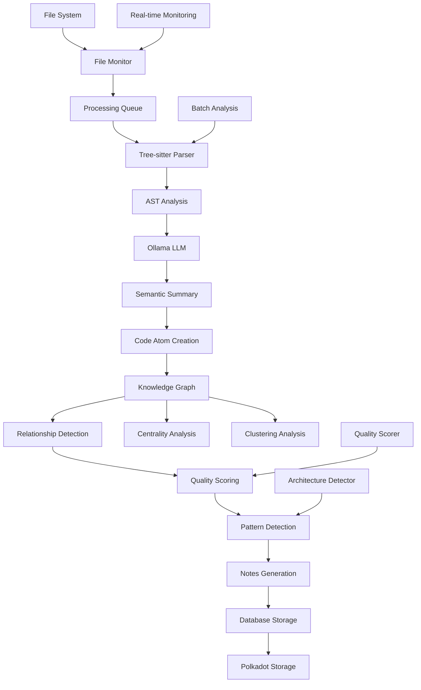

# AIA Automated Codebase Analysis & Knowledge Base System Architecture

## System Overview

The AIA Codebase Analysis System is a comprehensive software development agent that implements automated codebase analysis, knowledge graph construction, and intelligent insights generation with web3 integration.

## Core Components Architecture

### 1. **Deterministic AST Parsing Layer**
- **Tree-sitter Integration**: Multi-language parsing with dedicated parsers
- **Language Support**: Python, JavaScript, TypeScript, JSON, YAML, Markdown
- **Fallback Parser**: Regex-based parsing for unsupported languages
- **AST Hash Generation**: Deterministic hashing for change detection

```python
class TreeSitterParser:
    - parse_file(file_path, content) -> AST_Info
    - _extract_nodes(node) -> Node_Count
    - _extract_imports(node, language) -> Import_List
    - _calculate_complexity(node) -> Complexity_Score
```

### 2. **Knowledge Graph Construction**
- **NetworkX Backend**: Directed graph with weighted edges
- **Node Attributes**: File metadata, complexity metrics, timestamps
- **Edge Types**: imports, calls, inherits, implements, uses
- **Centrality Analysis**: Betweenness, closeness, degree, PageRank

```python
class KnowledgeGraph:
    - add_atom(atom: CodeAtom) -> void
    - add_relationship(relationship: KnowledgeRelationship) -> void
    - find_clusters(algorithm: str) -> Dict[str, List[str]]
    - calculate_centrality_metrics() -> Dict[str, Dict[str, float]]
    - detect_architectural_patterns() -> List[ArchitecturalPattern]
```

### 3. **Real-time File Monitoring**
- **Watchdog Integration**: File system event monitoring
- **Event Types**: created, modified, deleted
- **Filtering Logic**: Ignore patterns for cache/temp files
- **Async Processing Queue**: Background processing of file changes

```python
class FileMonitor(FileSystemEventHandler):
    - on_modified(event) -> callback('modified', path)
    - on_created(event) -> callback('created', path)
    - on_deleted(event) -> callback('deleted', path)
    - should_ignore(file_path) -> bool
```

### 4. **Local LLM Integration (Ollama)**
- **Semantic Analysis**: Code understanding and summarization
- **Structured Output**: JSON/YAML formatted responses
- **Context-aware Processing**: File type and AST information
- **Fallback Mechanisms**: Heuristic analysis when LLM unavailable

```python
class OllamaLLMClient:
    - generate_summary(code_content, context) -> semantic_summary
    - _fallback_summary(code_content, context) -> heuristic_summary
```

### 5. **Web3 Integration (Polkadot SDK)**
- **Decentralized Storage**: Knowledge hash storage on Polkadot
- **Cryptographic Security**: Content integrity verification
- **Substrate Interface**: Direct blockchain interaction
- **Mock Integration**: Fallback for development environments

```python
class PolkadotIntegration:
    - store_knowledge_hash(atom_id, content_hash) -> transaction_hash
    - _initialize_connection() -> substrate_interface
```

### 6. **Multi-Agent Coordination**
- **Cryptographic Security**: Post-quantum cryptography support
- **Agent Communication**: Secure message passing protocols
- **Task Distribution**: Dynamic workload balancing
- **Quality Scoring**: Graph-based contribution assessment

### 7. **Atomic Note Generation (Obsidian-style)**
- **Markdown Output**: Structured atomic notes with metadata
- **Cross-linking**: Automatic relationship linking
- **Tag Generation**: Intelligent tagging based on content analysis
- **Index Generation**: Overview and navigation aids

```python
class ObsidianNotesGenerator:
    - generate_atom_note(atom, quality_score) -> note_path
    - generate_index_note(atoms, patterns) -> index_path
    - _generate_tags(atom, quality_score) -> tag_list
```

## Data Flow Architecture



## Component Interactions

### 1. **File Processing Pipeline**
```
File Change Detection → Queue Processing → AST Parsing →
LLM Analysis → Atom Creation → Graph Update →
Relationship Detection → Quality Assessment → Note Generation
```

### 2. **Knowledge Graph Updates**
```
New Code Atom → Node Addition → Edge Detection →
Centrality Recalculation → Pattern Re-detection →
Quality Score Update → Database Persistence
```

### 3. **Real-time Monitoring Loop**
```
File System Event → Event Filtering → Queue Addition →
Background Processing → Incremental Updates →
Notification Generation → Index Regeneration
```

## API Specifications

### Core Data Models

```python
@dataclass
class CodeAtom:
    id: str
    file_path: str
    content: str
    ast_hash: str
    semantic_summary: str
    technical_context: Dict[str, Any]
    dependencies: List[str]
    exports: List[str]
    complexity_metrics: Dict[str, float]
    created_at: datetime
    updated_at: datetime
    file_type: FileType
    line_range: Tuple[int, int]

@dataclass
class KnowledgeRelationship:
    source_id: str
    target_id: str
    relationship_type: str  # 'imports', 'calls', 'inherits', 'implements', 'uses'
    weight: float
    metadata: Dict[str, Any]

@dataclass
class ArchitecturalPattern:
    pattern_name: str
    confidence: float
    components: List[str]
    description: str
    quality_score: float
```

### Main System Interface

```python
class AIACodebaseAnalysisSystem:
    async def analyze_project() -> Dict[str, Any]
    async def start_monitoring() -> void
    def stop_monitoring() -> void
    async def generate_insights_report() -> Dict[str, Any]

    # Internal methods
    def _discover_code_files() -> List[Path]
    async def _process_files_parallel(files) -> List[CodeAtom]
    def _detect_relationships(atoms) -> List[KnowledgeRelationship]
```

### Quality Scoring API

```python
class QualityScorer:
    def calculate_atom_quality_score(atom: CodeAtom) -> float
    def calculate_contributor_score(contributor_id: str, atoms: List[CodeAtom]) -> Dict[str, float]

    # Scoring components
    def _score_complexity(atom) -> float
    def _score_documentation(atom) -> float
    def _score_test_coverage(atom) -> float
    def _score_dependencies(atom) -> float
    def _score_centrality(atom_id) -> float
```

## Database Schema

### SQLite Database Structure

```sql
-- Code Atoms Table
CREATE TABLE code_atoms (
    id TEXT PRIMARY KEY,
    file_path TEXT NOT NULL,
    content TEXT,
    ast_hash TEXT,
    semantic_summary TEXT,
    technical_context TEXT,     -- JSON
    dependencies TEXT,          -- JSON array
    exports TEXT,              -- JSON array
    complexity_metrics TEXT,   -- JSON object
    created_at TIMESTAMP,
    updated_at TIMESTAMP,
    file_type TEXT,
    line_range_start INTEGER,
    line_range_end INTEGER
);

-- Relationships Table
CREATE TABLE relationships (
    id INTEGER PRIMARY KEY AUTOINCREMENT,
    source_id TEXT,
    target_id TEXT,
    relationship_type TEXT,
    weight REAL,
    metadata TEXT,             -- JSON
    FOREIGN KEY (source_id) REFERENCES code_atoms (id),
    FOREIGN KEY (target_id) REFERENCES code_atoms (id)
);

-- Quality Scores Table
CREATE TABLE quality_scores (
    atom_id TEXT PRIMARY KEY,
    quality_score REAL,
    calculated_at TIMESTAMP,
    FOREIGN KEY (atom_id) REFERENCES code_atoms (id)
);

-- Indexes for Performance
CREATE INDEX idx_file_path ON code_atoms (file_path);
CREATE INDEX idx_updated_at ON code_atoms (updated_at);
CREATE INDEX idx_relationships_source ON relationships (source_id);
CREATE INDEX idx_relationships_target ON relationships (target_id);
```

## Deployment Architecture

### 1. **Development Environment**
```bash
# Dependencies Installation
pip install tree-sitter networkx watchdog scikit-learn torch transformers
pip install substrate-interface requests sqlite3 pandas numpy

# Optional: Ollama Local LLM
curl https://ollama.ai/install.sh | sh
ollama pull llama2

# Optional: Polkadot Development Node
git clone https://github.com/paritytech/substrate
```

### 2. **Production Deployment**

#### Docker Configuration
```dockerfile
FROM python:3.10-slim

WORKDIR /app

# Install system dependencies
RUN apt-get update && apt-get install -y \
    build-essential \
    git \
    && rm -rf /var/lib/apt/lists/*

# Copy requirements
COPY requirements.txt .
RUN pip install --no-cache-dir -r requirements.txt

# Copy application
COPY . .

# Create directories
RUN mkdir -p /app/knowledge_notes /app/data

# Expose ports
EXPOSE 8000

# Run application
CMD ["python", "aia_codebase_analysis_system.py", "/app/project", "--monitor"]
```

#### Docker Compose for Full Stack
```yaml
version: '3.8'

services:
  aia-analysis:
    build: .
    volumes:
      - ./project:/app/project:ro
      - ./knowledge_notes:/app/knowledge_notes
      - ./data:/app/data
    environment:
      - OLLAMA_URL=http://ollama:11434
      - POLKADOT_NODE=wss://rpc.polkadot.io
    depends_on:
      - ollama
    ports:
      - "8000:8000"

  ollama:
    image: ollama/ollama:latest
    volumes:
      - ollama_data:/root/.ollama
    ports:
      - "11434:11434"

  redis:
    image: redis:alpine
    volumes:
      - redis_data:/data
    ports:
      - "6379:6379"

volumes:
  ollama_data:
  redis_data:
```

### 3. **Kubernetes Deployment**
```yaml
apiVersion: apps/v1
kind: Deployment
metadata:
  name: aia-codebase-analysis
spec:
  replicas: 1
  selector:
    matchLabels:
      app: aia-analysis
  template:
    metadata:
      labels:
        app: aia-analysis
    spec:
      containers:
      - name: aia-analysis
        image: aia/codebase-analysis:latest
        ports:
        - containerPort: 8000
        env:
        - name: OLLAMA_URL
          value: "http://ollama-service:11434"
        volumeMounts:
        - name: project-source
          mountPath: /app/project
          readOnly: true
        - name: knowledge-output
          mountPath: /app/knowledge_notes
        - name: database-storage
          mountPath: /app/data
      volumes:
      - name: project-source
        gitRepo:
          repository: "https://github.com/your-org/project"
      - name: knowledge-output
        persistentVolumeClaim:
          claimName: knowledge-pvc
      - name: database-storage
        persistentVolumeClaim:
          claimName: database-pvc
```

## Performance Optimization

### 1. **Parallel Processing**
- **ThreadPoolExecutor**: Concurrent file processing
- **Async/Await**: Non-blocking I/O operations
- **Queue-based**: Background processing for real-time updates
- **Batch Operations**: Database optimizations

### 2. **Memory Management**
- **Streaming Processing**: Large file handling
- **LRU Caching**: AST and analysis result caching
- **Garbage Collection**: Periodic cleanup of unused objects
- **Database Connection Pooling**: Efficient database access

### 3. **Scalability Considerations**
- **Horizontal Scaling**: Multiple analysis workers
- **Load Balancing**: Distribute file processing
- **Database Sharding**: Partition by project/organization
- **CDN Integration**: Static asset delivery

## Security Architecture

### 1. **Cryptographic Security**
- **Post-Quantum Cryptography**: Future-proof encryption
- **Content Hashing**: SHA-256 for integrity verification
- **Secure Communication**: TLS for all network communications
- **Key Management**: Secure storage and rotation

### 2. **Access Control**
- **Authentication**: Multi-factor authentication support
- **Authorization**: Role-based access control
- **Audit Logging**: Comprehensive activity logging
- **Data Privacy**: GDPR compliance mechanisms

### 3. **Web3 Integration Security**
- **Substrate Integration**: Secure blockchain interactions
- **Wallet Integration**: Hardware wallet support
- **Transaction Signing**: Secure key management
- **Network Security**: Protection against common attacks

## Monitoring and Observability

### 1. **Metrics Collection**
- **Processing Metrics**: Files processed, analysis time, queue depth
- **Quality Metrics**: Average quality scores, pattern detection rates
- **System Metrics**: CPU, memory, disk usage
- **Error Metrics**: Failed analyses, parsing errors

### 2. **Logging Strategy**
- **Structured Logging**: JSON format for machine parsing
- **Log Levels**: DEBUG, INFO, WARNING, ERROR, CRITICAL
- **Correlation IDs**: Track requests across components
- **Log Aggregation**: Centralized logging system

### 3. **Alerting System**
- **Real-time Alerts**: Critical system failures
- **Threshold Alerts**: Performance degradation
- **Anomaly Detection**: Unusual patterns in analysis results
- **Escalation Policies**: Automated incident response

## Integration Points

### 1. **IDE Integration**
- **VS Code Extension**: Real-time analysis and insights
- **JetBrains Plugin**: IntelliJ IDEA integration
- **Vim/Neovim**: Command-line interface
- **GitHub Actions**: CI/CD pipeline integration

### 2. **Version Control Integration**
- **Git Hooks**: Pre-commit analysis
- **GitHub/GitLab**: Pull request analysis
- **Bitbucket**: Repository insights
- **Azure DevOps**: Pipeline integration

### 3. **Third-party Tools**
- **JIRA Integration**: Issue tracking and quality metrics
- **Slack/Discord**: Notification and reporting
- **Confluence**: Documentation generation
- **SonarQube**: Code quality platform integration

## Future Enhancements

### 1. **Advanced AI Features**
- **Code Generation**: Automatic code completion and generation
- **Refactoring Suggestions**: AI-powered code improvements
- **Bug Prediction**: Machine learning for defect prediction
- **Performance Optimization**: Automated performance tuning

### 2. **Enhanced Web3 Features**
- **NFT Integration**: Code ownership and attribution
- **DAO Governance**: Decentralized decision making
- **Token Economics**: Incentive systems for quality contributions
- **Cross-chain Integration**: Multi-blockchain support

### 3. **Enterprise Features**
- **Multi-tenant Architecture**: Organization isolation
- **Advanced Analytics**: Executive dashboards and reporting
- **Compliance Automation**: Regulatory compliance checking
- **Enterprise SSO**: Corporate authentication integration

This architecture provides a comprehensive foundation for automated codebase analysis with advanced AI capabilities, web3 integration, and enterprise-grade scalability.